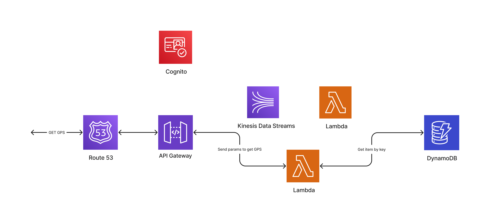
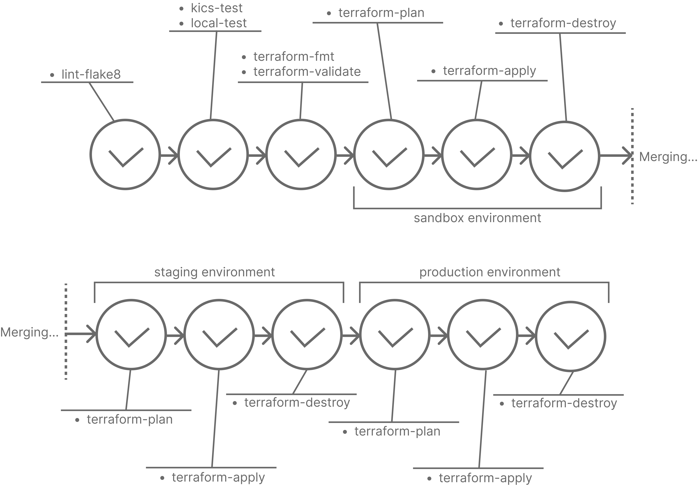

# Streaming data serverless REST API using AWS, Terraform, and Gitlab CI

This project deploys a serverless solution for streaming data, specifically bus GPS coordinates data,
using Kinesis Data Streams. It utilizes Terraform as an Infrastructure as Code (IaC) framework, with the
Terraform code organized into AWS service-based modules. The CI/CD pipeline is built on GitLab CI and deploys the
infrastructure to three distinct environments: sandbox, staging, and production, each with its own configuration.


AWS services are used:
* API Gateway
* Kinesis Data Streams
* Lambda
* DynamoDB
* Cognito
* Route 53

IaC tool is Terraform and CI/CD tool is GitLab CI.

## Architecture diagrams:

### POST GPS flow:


### GET GPS flow:


### Schema of CI/CD:



## Project setup:

Create .env file:
```
DYNAMODB_TABLE_NAME="Test"
DYNAMODB_HOST="localhost"
DYNAMODB_PORT="8000"
TTL_SECONDS="3600"
TTL_FIELD_NAME="expirationTime"
```
Set up python venv and install requirements:
```
python3 -m venv venv
source venv/bin/activate 
pip install -r requirements.txt
```
Run docker-compose:
```
docker-compose up -d
```

For local testing run the next commands:
```
flake8
pytest
```

For deploying project to AWS using Terraform locally
you have to delete ```backend "http" {}``` code line in ```./terraform/terraform.tf``` file and set up AWS credentials:
```
export AWS_ACCESS_KEY_ID="Your access key"
export AWS_SECRET_ACCESS_KEY="Your secret key"
```

WARNING: the project uses Route 53 managed domain. If you don't have one you should simply delete ```route53``` module
in ```./terraform/main.tf``` and delete/change outputs in ```./terraform/outputs.tf```

For deploying project via GitLab CI/CD you have to set up three different environments in GitLab Ci: sandbox, staging, and production
as well as set up AWS creds

## How to use it:
Firstly, you need to create a user in Cognito user pool and create a token to be able to post gps coordinates. After
user creating you can get an id token whether using hosted app ui or the next python code:
```python
import boto3

user_pool_id = "Your user pool id"
app_client_id = "Your app client id"
region = "Your region"


def get_cognito_id_token(username: str, password: str) -> str:
    client = boto3.client("cognito-idp", region_name=region)
    response = client.initiate_auth(
        AuthFlow="USER_PASSWORD_AUTH",
        AuthParameters={
            "USERNAME": username,
            "PASSWORD": password,
        },
        ClientId=app_client_id
    )
    return response["AuthenticationResult"]["IdToken"]

```

The example code of how to send coordinates:
```python
import base64
import json

import requests


URL = "Your POST API url"
TOKEN = "Your id token"
KINESIS_STREAM_NAME = "Your stream name"


def post_dict_data_to_kinesis(data: dict, partition_key: str) -> (int, str):
    jdata = json.dumps(data)
    bdata = jdata.encode("utf-8")
    b64data = base64.b64encode(bdata)
    sb64data = b64data.decode("utf-8")

    body = {
        "StreamName": KINESIS_STREAM_NAME,
        "Data": sb64data,
        "PartitionKey": partition_key,
    }
    headers = {
        "Content-Type": "application/json",
        "Authorization": TOKEN,
    }

    response = requests.post(URL, json=body, headers=headers)
    return response.status_code, response.text


# example of use
if __name__ == "__main__":
    partition_key = "17"  # unique bus id
    data = {
        "longitude": "12.34567",
        "latitude": "76.54321",
    }
    print(post_dict_data_to_kinesis(data, partition_key))

```
To run the code above you also need to install ```requests``` python library.
Partition key is used here to ensure the correct order sequence of coordinates for correct batch upload to DynamoDB.

To extract the coordinates from DynamoDB you can use the next code:
```python
import requests

URL = "Your GET API url"


def get_bus_coordinates(bus_id: str):
    params = {"busId": bus_id}
    return requests.get(URL, params)

```
Or just insert in your browser ```https://YOUR_GET_API_URL?busId=YOUR_BUS_ID```
